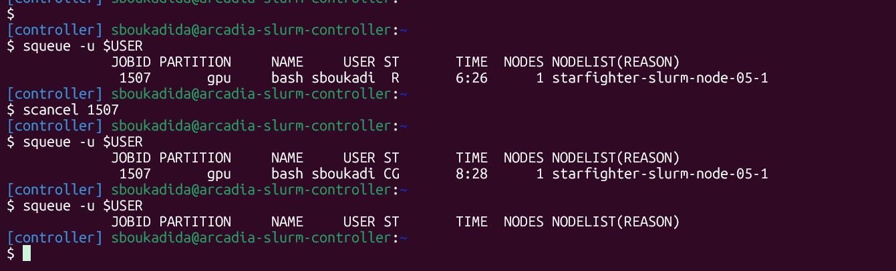

# CSC 8607 - Introduction au deep learning

## Exercice 1 - Utilisation de SLURM

### 1.c Connexion interactive
Sur le nœud de calcul, la commande `nvidia-smi` indique que le GPU alloué est un **NVIDIA L4**.

### 1.d Observation et arrêt du job
Après l'exécution de `squeue -u $USER`, le JobID est `1507`. La commande utilisée pour l’annuler a été : `scancel 1507`.

Après on peut voir comment le job a passé de status R (running) à CG puis il disparaît de la liste des jobs actifs.

### 1.e Soumission d’un script non interactif
Après avoir exécuté `sbatch hello.sh`, le fichier de log principal généré est `logs/hello-slurm-1738.out`.

### 1.f Analyse des jobs terminés
`ReqMem` est la mémoire demandée au moment du lancement du job, alors que `MaxRSS` est la mémoire réellement consommée au maximum pendant l’exécution. Ici, le job a demandé `8G`, mais son pic d’utilisation mémoire n’était que de `17744K`.

