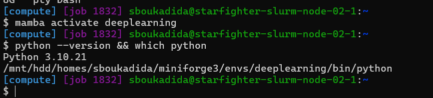
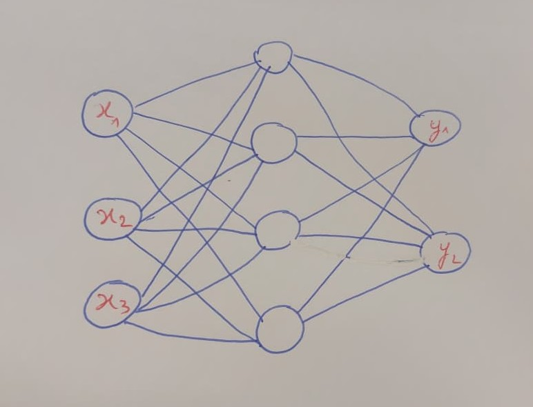
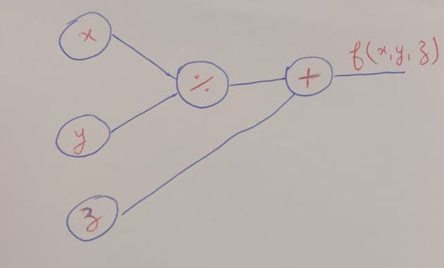
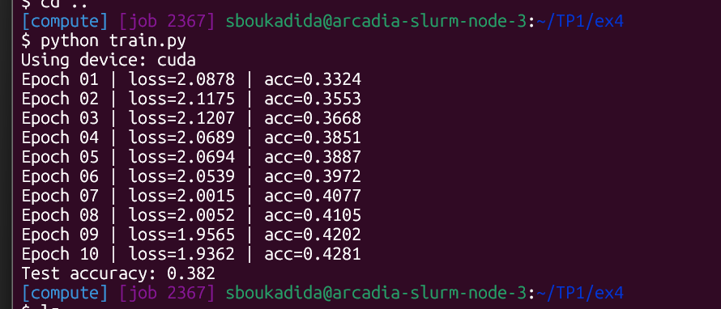
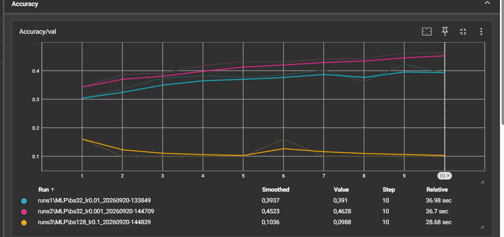
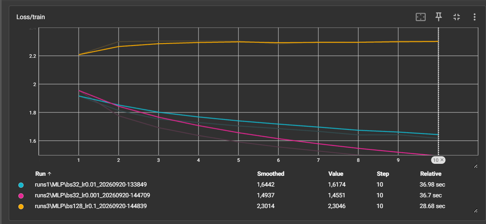
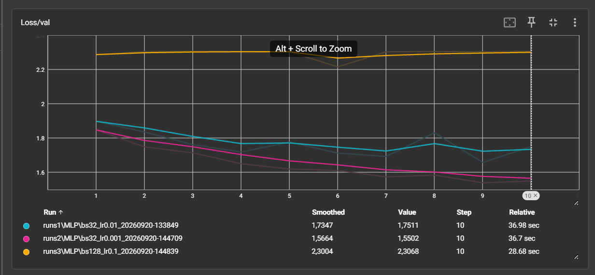

# CSC 8607 - Introduction au deep learning

## Exercice 1 - Utilisation de SLURM

### 1.c Connexion interactive
Sur le nœud de calcul, la commande `nvidia-smi` indique que le GPU alloué est un **NVIDIA L4**.


### 1.d Observation et arrêt du job
Après l'exécution de `squeue -u $USER`, le JobID est `1507`. La commande utilisée pour l’annuler est : `scancel 1507`.


Après on peut voir comment le job a passé de status R (running) à CG puis il disparaît de la liste des jobs actifs.


### 1.e Soumission d’un script non interactif
Après avoir exécuté `sbatch hello.sh`, le fichier de log principal généré est `logs/hello-slurm-1738.out`.


### 1.f Analyse des jobs terminés
`ReqMem` est la mémoire demandée au moment du lancement du job, alors que `MaxRSS` est la mémoire réellement consommée au maximum pendant l’exécution.


## Exercice 2 — Création d'un environnement virtuel Python

### 2.b Installation de Miniforge et création de l'environnement

Pour vérifier la version exacte de Python et le chemin du binaire utilisé dans
l'environnement actif, j'ai exécuté :

```bash
python --version && which python
```

Résultat obtenu :



### 2.d Vérification de PyTorch et de CUDA

Le fichier `check_gpu.py` contient :

```python
import torch

print("PyTorch version:", torch.__version__)
gpu_available = torch.cuda.is_available()
print("CUDA available:", gpu_available)

if gpu_available:
	print("Device count:", torch.cuda.device_count())
	print("Device 0 name:", torch.cuda.get_device_name(0))
else:
	print("Attention, aucun GPU détecté !")
```

Je l'ai exécuté avec :

```bash
python check_gpu.py
```

Sortie obtenue :

```text
$ python check_gpu.py
PyTorch version: 2.4.0
CUDA available: True
Device count: 1
```

`CUDA available` vaut `False`, deux causes possibles sont une réservation sans GPU (ou une commande exécutée sur le nœud de connexion) et une installation incompatible ou incomplète de PyTorch/CUDA dans l'environnement actif.

### 2.f Vérification de TensorBoard

La commande permettant d'afficher la version installée est :

```bash
tensorboard --version
```


## Exercice 3 — Exercices théoriques

### 3.a Architecture et paramètres



**Nombre de paramètres**

Sans les biais :
- Couche 1 (entrée → cachée) : 3 × 4 = 12
- Couche 2 (cachée → sortie) : 4 × 2 = 8
- **Total = 20 paramètres**

Avec les biais :
- Couche 1 : 12 + 4 = 16
- Couche 2 : 8 + 2 = 10
- **Total = 26 paramètres**

### 3.b Équations et dimensions

$$H = \mathrm{ReLU}(X W_1^\top + b_1)$$
$$Y = H W_2^\top + b_2$$

```
X  : (N, 3)
W1 : (4, 3)
b1 : (1, 4) -> diffusé en (N, 4)
H  : (N, 4)
W2 : (2, 4)
b2 : (1, 2) -> diffusé en (N, 2)
Y  : (N, 2)
```

### 3.c Graphe de calcul et rétropropagation



Le graphe comporte deux nœuds intermediaires : une division `q = x / y`, puis une addition
`f = q + z`.

**Forward pass** (x = 2, y = 4, z = 0)

$$q = \frac{2}{4} = 0.5 \qquad f = 0.5 + 0 = 0.5$$

**Backpropagation**

Nœud division ($q = x / y$), gradients locaux :
$$\frac{\partial q}{\partial x} = \frac{1}{y} = \frac{1}{4} = 0.25
\qquad
\frac{\partial q}{\partial y} = -\frac{x}{y^2} = -\frac{2}{16} = -0.125$$

Règle de la chaîne (multiplication par le gradient amont $\partial f/\partial q = 1$) :
$$
\frac{\partial f}{\partial x} = \frac{\partial f}{\partial q} \times \frac{\partial q}{\partial x} = 1 \times 0.25 = 0.25
$$
$$
\frac{\partial f}{\partial y} = \frac{\partial f}{\partial q} \times \frac{\partial q}{\partial y} = 1 \times (-0.125) = -0.125
$$
$$
\frac{\partial f}{\partial z} = 1
$$

### 3.d Mise à jour des poids (η = 1)

Règle de mise à jour : $w' = w - \eta \cdot \dfrac{\partial f}{\partial w}$

$$x' = 2 - 1 \times 0.25 = 1.75$$
$$y' = 4 - 1 \times (-0.125) = 4.125$$
$$z' = 0 - 1 \times 1 = -1$$

Nouvelle sortie :
$$f' = \frac{1.75}{4.125} + (-1) \approx 0.4242 - 1 = -0.576$$

La valeur est passée de 0.5 à −0.576 : elle a bien diminué, comme attendu
puisqu'on se déplace dans la direction opposée au gradient.

### 3.e Questions de réflexion

**Pourquoi la règle de la chaîne ?**

Un réseau profond est une composition de fonctions, donc la perte dépend des poids
des premières couches à travers toutes les couches suivantes. La règle de la chaîne
permet de calculer les gradients en multipliant des dérivées locales, ce qui rend
la rétropropagation simple et efficace.

**Pourquoi des mini-batchs ?**

Avec un seul exemple, le gradient est trop bruité ; avec tout le dataset, chaque
mise à jour est trop coûteuse. Le mini-batch est le bon compromis : il donne un
gradient assez stable tout en restant rapide et efficace sur GPU.

### 3.6 Association tâche / sortie / perte
```
Tâche                   | Fonction finale (Sortie) | Fonction de perte (Loss)
------------------------|--------------------------|---------------------------
Classification binaire  | 1. Sigmoïde              | A. BCE (Binary Cross-Entropy)
Classification multi    | 2. Softmax               | B. Cross-Entropy
Régression pure         | 3. Identité (aucune)     | C. MSE (Mean Squared Error)
```

## Exercice 4 - Premier réseau de neurones

### 4.a  Préparation des données
`batch_size` fixe le nombre d'exemples traités à chaque itération. `shuffle` mélange les données avant chaque époque pour l'entraînement ; il doit être `False` puisque dans le test il n'y a pas de mise à jour des poids donc l'ordre n'influence pas le resultat et pour garder les predictions reproductibles.

### 4.b Implémentation du réseau
1. Puisque la couche linéaire attend uun vecteur en entrée, alors `torch.flatten(x, 1)` est nécessaire pour convertir chaque image en un vecteur 1D.Donc chaque image est applatie.
2. On ne met pas `Softmax` avant `nn.CrossEntropyLoss` car cette loss l'applique déjà en interne.Donc il n'est pas nécessaire de l'ajouter manuellement.

### 4.c Entraînement du modèle

- optimizer.zero_grad() : remet à zéro les gradients accumulés des paramètres, avant le calcul
- loss.backward() : calcule les gradients par rétropropagation, de la perte jusqu'à chaque paramètre
- Sans zero_grad(), les gradients s'accumuleraient d'une itération à l'autre au lieu d'être recalculés proprement

### 4.d Évaluation sur l’ensemble de test
1. with torch.no_grad() : désactive le calcul et le stockage des gradients (pas de backward en évaluation)
- Pas de graphe de calcul construit, pas d'activations conservées → moins de mémoire utilisée, calcul plus rapide
2. CIFAR-10 comporte 10 classes. Un classificateur qui choisit une classe au hasard a donc une probabilité moyenne de `1/10`, soit environ `10 %`d'accuracy sur le jeu de test.

## Exercice 5 - Utilisation de TensorBoard

### 5.a Préparation : séparation train/validation et hyperparamètres

La date et l'heure rendent chaque `run_name` unique, évitent d'écraser les logs existants et permettent de conserver l'ordre des expériences. Les hyperparamètres identifient la configuration de chaque run afin de comparer et reproduire facilement les résultats dans TensorBoard.


### 5.d Visualisation TensorBoard


Le niveau de smoothing **0.6** : il rend la tendance décroissante de `Loss/train_step` visible sans masquer les variations
importantes. À `0.0` ou `0.3`, la courbe reste trop bruitée, tandis qu'à `0.8`, le lissage masque davantage les changements rapides.

`Loss/train_step` est plus bruitée que `Loss/train` parce qu'elle est calculée
sur un seul batch,par contre `Loss/train` est une moyenne sur toute l'époque et ses fluctuations aléatoires sont donc
fortement réduites.

### 5.e Mini-sweep d'hyperparamètres et diagnostic du sur-apprentissage
**Accuracy**

Note : la courbe `runs1` correspond à `lr=1e-2, batch_size=32`,
`runs2` à `lr=1e-3, batch_size=32` et `runs3` à `lr=1e-1, batch_size=128`.
**Loss Train courbe**

**Loss Validation courbe**

| Run | Learning rate | Batch size | Meilleure accuracy validation |
|-----|---------------|------------|-------------------------------|
| 1   | `1e-2`        | `32`       |  `0,3956`                 |
| 2   | `1e-3`        | `32`       | `0,4623`                       |
| 3   | `1e-1`        | `128`      |  `0,1608`                 |

La meilleure configuration est le **Run 2** (`lr=1e-3, batch_size=32`), avec
une accuracy de validation maximale de `0,4623`.

Les courbes 1 et 2 diminuent progressivement leur `Loss/train` et leur `Loss/val`. Le Run 2 obtient la meilleure accuracy de validation (`0,4623`) et la perte de validation la plus basse. 
Pour la courbe 3, les deux pertes restent élevées et presque constantes, ce qui indique que le taux d'apprentissage `1e-1` est trop grand pour apprendre correctement.

On détecte un sur-apprentissage lorsque la `Loss/train` continue de diminuer, alors que la `Loss/val` cesse de diminuer puis augmente. 
A ce moment la le modèle devient meilleur sur les exemples d'entraînement, mais généralise moins bien sur les exemples de validation.


