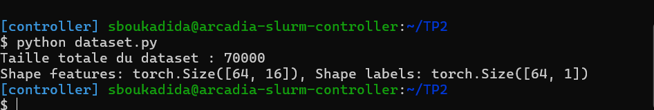
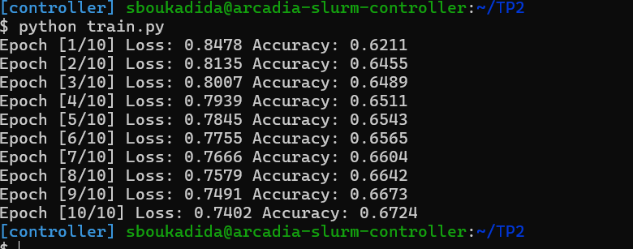
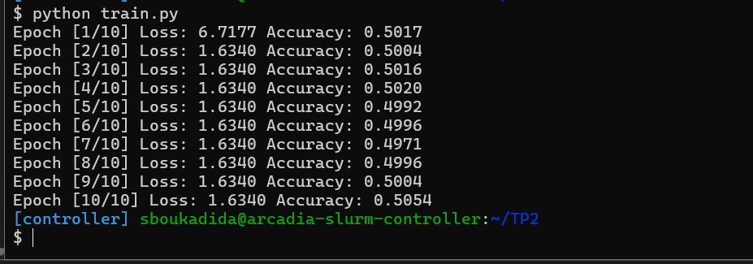
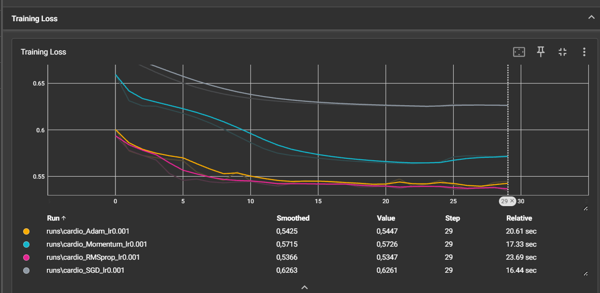

## Exercice 1 - Création d'un dataset personnalisé

### 1. Pourquoi l'utilisation de `StandardScaler` avant le split est-elle une mauvaise pratique ?

`StandardScaler` calcule la moyenne et l'écart-type à partir des données. Si on l'ajuste sur l'ensemble du dataset avant de séparer les données, les statistiques des ensembles de validation et de test sont utilisées indirectement pendant l'entraînement. C'est une fuite de données (*data leakage*).

Le score obtenu sur la validation ou le test peut alors être  trop optimiste, car le prétraitement a déjà observé ces données. La procédure correcte est de faire le split d'abord, d'ajuster le scaler uniquement sur l'ensemble d'entraînement, puis d'appliquer ce même scaler aux ensembles de validation et de test.

### 2. Quelle classe utiliser si le dataset ne tient pas en RAM ?

Il faut utiliser `torch.utils.data.IterableDataset`. Cette classe permet de lire et de produire les exemples progressivement, par flux ou par morceaux, sans charger tout le dataset en mémoire. Elle est adaptée aux fichiers très volumineux et aux données accessibles de manière séquentielle.

## Exercice 2 - MLP et régularisation L1 / L2


**Avec L1 = 1e-4 et L2 = 1e-3**

### 1. Effet de `l1_lambda = 0.1` et `l2_lambda = 0`


Avec `l1_lambda = 0.1` et `l2_lambda = 0`, la loss vaut `6.7177` à la première époque, puis `1.6340` à partir de la deuxième époque et reste pratiquement constante jusqu'à la fin. L'accuracy reste proche de `50 %` sur les 10 époques, ce qui correspond à un comportement aléatoire pour une classification binaire.

La pénalité L1 est trop forte par rapport à la loss de classification. Elle pousse fortement les poids vers zéro et empêche le réseau d'apprendre correctement les relations entre les variables et la cible. Le modèle est alors trop contraint : il présente un **sous-apprentissage** (*underfitting*). 

### 2. Argument de l'optimiseur permettant d'appliquer automatiquement L2

L'argument est `weight_decay`. Par exemple :

```python
optimizer = optim.SGD(model.parameters(), lr=0.01, weight_decay=1e-3)
```

Il ajoute automatiquement une pénalité de type L2 lors de la mise à jour des poids.

### 3. Différence entre régularisation L1 et L2

La régularisation L1 ajoute une pénalité proportionnelle à la somme des valeurs absolues des poids :

$$
\lambda \sum_i |w_i|
$$

Elle pousse certains poids exactement vers 0. Le réseau devient donc plus sparce : certains neurones peuvent être pratiquement ignorés. 

La régularisation L2 ajoute une pénalité proportionnelle à la somme des carrés des poids :

$$
\lambda \sum_i w_i^2
$$

Elle pousse les poids à devenir petits, mais sans atteindre exactement zéro. Le réseau conserve donc davantage de connexions, avec des poids de faible amplitude. 
## Exercice 3 - Comparaison des optimiseurs et TensorBoard

### 1. Courbes TensorBoard



### 2. Optimiseur convergeant le plus rapidement initialement

D'après les courbes, **RMSprop** converge le plus rapidement initialement : sa loss diminue fortement dès les premières époques. Il obtient également la meilleure loss finale, avec une valeur d'environ `0,5347`. Adam présente aussi une convergence rapide au debut et termine avec une loss proche de `0,5447`.


### 3. Différence entre SGD simple et Momentum

La courbe du SGD simple diminue lentement et reste à une loss élevée à la fin de l'entraînement, avec une valeur de `0,6261`. La courbe de Momentum diminue plus rapidement et atteint une loss finale plus faible, égale à `0,5726`.

L'ajout du moment permet de conserver une partie de la direction des mises à jour précédentes. Il accélère ainsi la descente dans les directions cohérentes et réduit les oscillations causées par les variations des gradients entre les mini-lots. Donc ici , Momentum améliore donc la vitesse et la stabilité de la convergence par rapport au SGD simple.

## Exercice 4 - Analyse des métriques

### 1. Définitions de la précision et du rappel

La **précision** mesure la proportion de prédictions positives qui sont correctes :

$$
\mathrm{Precision} = \frac{TP}{TP + FP}
$$


Le **rappel** mesure la proportion de vrais positifs correctement détectés :

$$
\mathrm{Rappel} = \frac{TP}{TP + FN}
$$


### 2. Métrique à privilégier dans le contexte médical

Il faut généralement privilégier un **rappel élevé**.

 Dans la détection d'une maladie cardiovasculaire, un faux négatif signifie qu'une personne malade est déclarée à tort comme non malade. Cette erreur peut retarder un diagnostic et une prise en charge.

Une baisse de précision peut entraîner davantage d'examens complémentaires pour les personnes faussement positives, mais cette conséquence est souvent moins grave qu'un cas malade non détecté. 
### 3. Intérêt de l'AUC par rapport aux métriques au seuil 0.5

L'AUC mesure la capacité du modèle à distinguer les malades des non-malades pour différents seuils, contrairement à Precision et Recall calculés ici avec un seuil fixe de 0,5. Une AUC proche de 1 indique une bonne capacité de discrimination.
